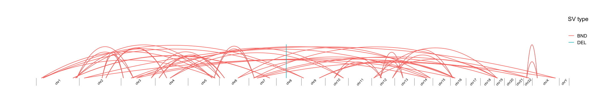

## Visualise CNV and SV data

Scripts for visualisation of copy-number variants (CNV) and [structural variants](https://github.com/umccr/CNV_SV-visualisation/tree/master/SVbezierPlot.md) (SV) data.

### Table of contents

<!-- vim-markdown-toc GFM -->
* [SV visualisation](#sv-visualisation)
* [CNV visualisation](#cnv-visualisation)

<!-- vim-markdown-toc -->

---

### SV visualisation

**Script**: *[SVbezierPlot.R](https://github.com/umccr/CNV_SV-visualisation/tree/master/SVbezierPlot.R)*

Argument | Description
------------ | ------------
--bedpe | [*BEDPE*](http://bedtools.readthedocs.io/en/latest/content/general-usage.html#bedpe-format) file to be processed
--output | Output plot name (saved as png file)


Note, if no *--output* argument is specified the output file will have the same name as the input *BEDPE* file with added *_SVbezier* at the end and the extension changes to *.png*.
<br>

Command line use example:

```
Rscript SVbezierPlot.R --bedpe example_data/structural/example-manta-pass.bedpe --output example_data/structural/SVbezierPlot.png
```
<br>

This will output a **bezier curves-like plot** representing structural variants from the [*BEDPE*](http://bedtools.readthedocs.io/en/latest/content/general-usage.html#bedpe-format) file generated with [Manta](https://github.com/Illumina/manta).


<!-- -->

<br>

---


### CNV visualisation

The scripts for CNV data visualisation, including B allele frequency (BAF) and log R ratio (LLR) plots, will be added later.

