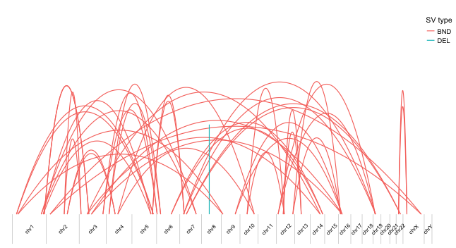

## Bezier curves-like plot for structural variants visualisation

Script generating a bezier curves-like plot representing structural variants (SVs) listed in specified BEDPE file. Currently the script plots take into account only the start of each segement (*START_A* and *START_B* columns in the *BEDPE* file) to plot the bezier curves between the different genomic locations of the event.

There is also a command line version of this script where one can specify the input file (\--bedpe), output plot name (\--output), as well as the genome build version (\--g_build) using the command line arguments.

<br>
#### Load libraries

```r
suppressMessages(library(ggplot2))
suppressMessages(library(ggforce))
suppressMessages(library(BSgenome.Hsapiens.UCSC.hg38))
```

<br>
#### Read BEDPE file

Read the *BEDPE* file and extract the SVs info including start and end chromosomes, positions, as well as the variant type


```r
##### Read the BEDPE file
sv.data <- read.table(file="example_data/structural/example-manta-pass.bedpe", sep="\t", as.is=TRUE, header=TRUE, comment.char="")

##### Get the SV chromosomes...
chr1 <- paste0("chr", sv.data$X.CHROM_A)
chr2 <- paste0("chr", sv.data$CHROM_B)

##### ...positions
pos1 <- sv.data$START_A
pos2 <- sv.data$START_B

##### ... and the events type
type <- sv.data$ID
type = gsub("Manta","", type)
type = gsub(":\\d+","", type)
```

<br>
#### Prepare x-axis coordinates info for ggplot

This part of the script converts the genomic positions from hg38 (other genome build can be selected using the command line script) to coordinates that can be plotted on the ggplot x-axis.

Start with calculating the whole genome length. Here we consider chromosomes 1-22, X and Y

```r
genome.length = sum(seqlengths(Hsapiens)[1:24])
```

Now calculate fake chromosomes' start positions so that they match with the x-axis coordinates in the ggplot

```r
chrs_fake_starts <- vector("list", 24)
chrs_fake_starts  <- setNames(chrs_fake_starts,  names(Hsapiens)[1:24] )
```

Chromosome 1 has coordingate 0

```r
chrs_fake_starts[["chr1"]] <- 0
```

The coordinates for the remaining chromosomes will be calculated by adding the lengths of individual preceding chromosomes

```r
length_sum <- 0

for ( i in 2:length(chrs_fake_starts) ) {

#	cat(paste0("\nCalculations for " , names(chrs_fake_starts)[i], "...", sep=""))
	cat(paste("\nThe fake start position for " , names(chrs_fake_starts)[i], " is ", length_sum + as.numeric(seqlengths(Hsapiens)[[i-1]]), sep=""))
#	cat(paste("\nLength of " , names(chrs_fake_starts)[i-1], " = ", as.numeric(seqlengths(Hsapiens)[[i-1]]), " and the sum of the preceding chromosomes = ", length_sum, ".\n\n", sep=""))

	length_sum <- length_sum + as.numeric(seqlengths(Hsapiens)[[i-1]])
	chrs_fake_starts[[names(Hsapiens)[i]]] <- length_sum
}
```

```
## The fake start position for chr2 is 248956422
## The fake start position for chr3 is 491149951
## The fake start position for chr4 is 689445510
## The fake start position for chr5 is 879660065
## The fake start position for chr6 is 1061198324
## The fake start position for chr7 is 1232004303
## The fake start position for chr8 is 1391350276
## The fake start position for chr9 is 1536488912
## The fake start position for chr10 is 1674883629
## The fake start position for chr11 is 1808681051
## The fake start position for chr12 is 1943767673
## The fake start position for chr13 is 2077042982
## The fake start position for chr14 is 2191407310
## The fake start position for chr15 is 2298451028
## The fake start position for chr16 is 2400442217
## The fake start position for chr17 is 2490780562
## The fake start position for chr18 is 2574038003
## The fake start position for chr19 is 2654411288
## The fake start position for chr20 is 2713028904
## The fake start position for chr21 is 2777473071
## The fake start position for chr22 is 2824183054
## The fake start position for chrX is 2875001522
## The fake start position for chrY is 3031042417
```

Calculate the coordinates for x-axis labels (chr1, chr2...) for ggplot by adding the half-lenght of each chrosomome to its fake start

```r
chrs_fake_label.pos <- vector("list", 24)
chrs_fake_label.pos  <- setNames(chrs_fake_label.pos,  names(Hsapiens)[1:24] )

for ( i in 1:length(chrs_fake_starts) ) {

	chrs_fake_label.pos[[names(Hsapiens)[i]]] <- seqlengths(Hsapiens)[[i]]/2 + chrs_fake_starts[[names(Hsapiens)[i]]]

	cat(paste("\nThe x-axis coordinate for " , names(chrs_fake_starts)[i], " label is ", chrs_fake_label.pos[[names(Hsapiens)[i]]], " = ",  seqlengths(Hsapiens)[[i]]/2, " (half-length) + ", chrs_fake_starts[[names(Hsapiens)[i]]]," (fake start)", sep=""))
#	cat(paste("\nLength of " , names(chrs_fake_starts)[i], " = ", seqlengths(Hsapiens)[[i]], " and the fake start of chromosome ", names(Hsapiens)[i], " = ", chrs_fake_starts[[names(Hsapiens)[i]]], ".\n\n", sep=""))
}
```

```
## The x-axis coordinate for chr1 label is 124478211 = 124478211 (half-length) + 0 (fake start)
## The x-axis coordinate for chr2 label is 370053186.5 = 121096764.5 (half-length) + 248956422 (fake start)
## The x-axis coordinate for chr3 label is 590297730.5 = 99147779.5 (half-length) + 491149951 (fake start)
## The x-axis coordinate for chr4 label is 784552787.5 = 95107277.5 (half-length) + 689445510 (fake start)
## The x-axis coordinate for chr5 label is 970429194.5 = 90769129.5 (half-length) + 879660065 (fake start)
## The x-axis coordinate for chr6 label is 1146601313.5 = 85402989.5 (half-length) + 1061198324 (fake start)
## The x-axis coordinate for chr7 label is 1311677289.5 = 79672986.5 (half-length) + 1232004303 (fake start)
## The x-axis coordinate for chr8 label is 1463919594 = 72569318 (half-length) + 1391350276 (fake start)
## The x-axis coordinate for chr9 label is 1605686270.5 = 69197358.5 (half-length) + 1536488912 (fake start)
## The x-axis coordinate for chr10 label is 1741782340 = 66898711 (half-length) + 1674883629 (fake start)
## The x-axis coordinate for chr11 label is 1876224362 = 67543311 (half-length) + 1808681051 (fake start)
## The x-axis coordinate for chr12 label is 2010405327.5 = 66637654.5 (half-length) + 1943767673 (fake start)
## The x-axis coordinate for chr13 label is 2134225146 = 57182164 (half-length) + 2077042982 (fake start)
## The x-axis coordinate for chr14 label is 2244929169 = 53521859 (half-length) + 2191407310 (fake start)
## The x-axis coordinate for chr15 label is 2349446622.5 = 50995594.5 (half-length) + 2298451028 (fake start)
## The x-axis coordinate for chr16 label is 2445611389.5 = 45169172.5 (half-length) + 2400442217 (fake start)
## The x-axis coordinate for chr17 label is 2532409282.5 = 41628720.5 (half-length) + 2490780562 (fake start)
## The x-axis coordinate for chr18 label is 2614224645.5 = 40186642.5 (half-length) + 2574038003 (fake start)
## The x-axis coordinate for chr19 label is 2683720096 = 29308808 (half-length) + 2654411288 (fake start)
## The x-axis coordinate for chr20 label is 2745250987.5 = 32222083.5 (half-length) + 2713028904 (fake start)
## The x-axis coordinate for chr21 label is 2800828062.5 = 23354991.5 (half-length) + 2777473071 (fake start)
## The x-axis coordinate for chr22 label is 2849592288 = 25409234 (half-length) + 2824183054 (fake start)
## The x-axis coordinate for chrX label is 2953021969.5 = 78020447.5 (half-length) + 2875001522 (fake start)
## The x-axis coordinate for chrY label is 3059656124.5 = 28613707.5 (half-length) + 3031042417 (fake start)
```

<br>
#### Calculate ggplot x-axis coordinates for SV

Calculate the coordinates to draw bezier curves by adding the SV position info to the fake start coordinates of corresponding chromosomes

```r
pos1_fake <- vector("list", nrow(sv.data))
pos2_fake <- vector("list", nrow(sv.data))

for ( i in 1:nrow(sv.data) ) {

	cat(paste("\nCalculations for SV: " , paste( chr1[i], pos1[i], sep=" " ), "-",  paste( chr2[i], pos2[i], sep=" " ), sep=""))
	cat(paste("\nThe x-axis coordinate for position 1 is ", chrs_fake_starts[[chr1[i]]] + pos1[i], " = ",  chrs_fake_starts[[chr1[i]]], " (the fake start of ", chr1[i],") + ", pos1[i], " (the real position 1)", sep=""))
	cat(paste("\nThe x-axis coordinate for position 2 is ", chrs_fake_starts[[chr2[i]]] + pos2[i], " = ",  chrs_fake_starts[[chr2[i]]], " (the fake start of ", chr2[i],") + ", pos2[i], " (the real position 2).\n", sep=""))

	pos1_fake[[i]] <- chrs_fake_starts[[chr1[i]]] + pos1[i]
	pos2_fake[[i]] <- chrs_fake_starts[[chr2[i]]] + pos2[i]
}
```

```
## Calculations for SV: chr1 29416966-chr5 157376567
## The x-axis coordinate for position 1 is 29416966 = 0 (the fake start of chr1) + 29416966 (the real position 1)
## The x-axis coordinate for position 2 is 1037036632 = 879660065 (the fake start of chr5) + 157376567 (the real position 2).
## 
## Calculations for SV: chr1 39559701-chr9 13237205
## The x-axis coordinate for position 1 is 39559701 = 0 (the fake start of chr1) + 39559701 (the real position 1)
## The x-axis coordinate for position 2 is 1549726117 = 1536488912 (the fake start of chr9) + 13237205 (the real position 2).
## 
## Calculations for SV: chr1 211768443-chr7 121001796
## The x-axis coordinate for position 1 is 211768443 = 0 (the fake start of chr1) + 211768443 (the real position 1)
## The x-axis coordinate for position 2 is 1353006099 = 1232004303 (the fake start of chr7) + 121001796 (the real position 2).
## 
## Calculations for SV: chr1 226466151-chr5 139934838
## The x-axis coordinate for position 1 is 226466151 = 0 (the fake start of chr1) + 226466151 (the real position 1)
## The x-axis coordinate for position 2 is 1019594903 = 879660065 (the fake start of chr5) + 139934838 (the real position 2).
## 
## Calculations for SV: chr1 233997283-chr3 71583534
## The x-axis coordinate for position 1 is 233997283 = 0 (the fake start of chr1) + 233997283 (the real position 1)
## The x-axis coordinate for position 2 is 562733485 = 491149951 (the fake start of chr3) + 71583534 (the real position 2).
## ...
```

Get random number for the bezier curves' heigths and caluclate the middle point for each bezier curve

```r
beziers.height <- runif(nrow(sv.data), 1, 2)
beziers.mid <- unlist(pos1_fake)+(unlist(pos2_fake)-unlist(pos1_fake))/2
```

Create dataframe with beziers curves info

```r
beziers <- data.frame(
    x = c(rbind( unlist(pos1_fake), beziers.mid, unlist(pos2_fake) )),
    y = c(rbind( 0.2, beziers.height, 0.2 ) ),
    group = rep( paste( chr1, pos1, chr2, pos2, sep="_" ), each=3),
		svtype = rep( type, each=3)
)
```

Generate a bezier curves-like plot representing SVs

```r
ggplot() + geom_bezier(aes(x= x, y = y, group = group, color = svtype ), data = beziers, show.legend = TRUE, size = 0.4) +

		##### Remove default axes labels and grey backgroud
		theme(axis.title.x=element_blank(), axis.text.x= element_blank(), axis.ticks.x=element_blank(), axis.title.y=element_blank(), axis.text.y= element_blank(), axis.ticks.y=element_blank(),
		##### ...and the grey backgroud
					panel.background = element_rect(fill = NA),
		##### ...change the legend parameters
					legend.title=element_text(size=8), legend.text=element_text(size=7), legend.key.size = unit(0.7,"line"), legend.key= element_blank(), legend.position = c(0.97,0.7) ) +

		##### Set the axes limits
		scale_x_continuous(limits = c(1, genome.length)) +
		scale_y_continuous(limits = c(0, 2)) +

		##### Add chromosomes boundaries
		geom_segment(aes(x = c(1,unlist(chrs_fake_starts)[2:24],genome.length) , xend = c(1,unlist(chrs_fake_starts)[2:24],genome.length), y = 0, yend = 0.2), colour = 'grey', size = 0.2) +

		labs( color = "SV type") +

		##### Add chromosomes labels
		annotate(geom = 'text', label = names(chrs_fake_label.pos), x = unlist(chrs_fake_label.pos), y = 0.1, size = 2, angle = 45)
```

<!-- -->

<br>
Print session info

```r
sessionInfo()
```

```
## R version 3.5.0 (2018-04-23)
## Platform: x86_64-apple-darwin15.6.0 (64-bit)
## Running under: macOS High Sierra 10.13.4
## 
## Matrix products: default
## BLAS: /Library/Frameworks/R.framework/Versions/3.5/Resources/lib/libRblas.0.dylib
## LAPACK: /Library/Frameworks/R.framework/Versions/3.5/Resources/lib/libRlapack.dylib
## 
## locale:
## [1] en_AU.UTF-8/en_AU.UTF-8/en_AU.UTF-8/C/en_AU.UTF-8/en_AU.UTF-8
## 
## attached base packages:
## [1] stats4    parallel  stats     graphics  grDevices utils     datasets 
## [8] methods   base     
## 
## other attached packages:
##  [1] BSgenome.Hsapiens.UCSC.hg38_1.4.1 BSgenome_1.48.0                  
##  [3] rtracklayer_1.40.2                Biostrings_2.48.0                
##  [5] XVector_0.20.0                    GenomicRanges_1.32.3             
##  [7] GenomeInfoDb_1.16.0               IRanges_2.14.10                  
##  [9] S4Vectors_0.18.2                  BiocGenerics_0.26.0              
## [11] ggforce_0.1.1                     ggplot2_2.2.1       
```
